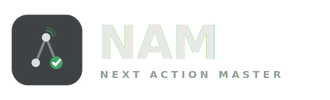

<div align="center">
  
  <br/>
  <em>A local-first, GTD-inspired personal productivity desktop app built with Java and Swing.</em>
</div>

---

## What is NamDesktop?

NamDesktop is a desktop application for managing your work through a GTD-inspired system. It is **local-first**: all data lives in a single node tree stored locally as JSON — a file on your machine, with no account required and cloud sync entirely optional.

The same underlying nodes are interpreted differently depending on where they sit in the tree, their status, their tags, and which lens (view) is active. The goal is a small, fast, focused tool that stays out of your way.

## NamDesktop and NamWeb

NamDesktop is part of the **Nam** suite. Its sibling, **[NamWeb](https://github.com/Aha43/NamWeb)**, is a standalone, self-serve web app — live at **[usenam.app](https://usenam.app)** — and is now the **primary product** for most users: sign up and start, nothing to install.

**NamDesktop is the concept lab and power sidekick.** It carries the richer workbench — drag-ordering, the Project Workbench with Column and Readiness layouts, Mission Control / Goal Boards, project templates, the focus deck — where ideas are prototyped before they reach the web. It stays local-first; cloud sync to your Nam account is optional.

The two apps are **separate repositories that share only the Supabase HTTP contract** — the same backend that powers NamWeb and desktop cloud sync. The database **migrations live here**, in this repo's [`supabase/`](supabase/) directory, as the single source of truth for that contract.

## Features

**Capture and process**
- **Inbox** — capture anything quickly; process each item into an action, a project, or delete it
- **Bulk entry** — paste multiple lines to create several actions at once

**Organise**
- **Projects** — nodes with children; nest sub-projects to any depth
- **Project Workbench** — action-forward view of a project and its sub-projects; inline rename, status toggle, drag-free reorder
- **Next Actions** — nodes with status `NEXT`; what you can actually do right now
- **Backlog** — nodes with status `BACKLOG`; parked for later without losing them
- **Done** — completed actions kept for reference

**Focus**
- **Context / Tags** — filter next actions by tags (`@home`, `@computer`, …)
- **Saved Views** — save a tag filter as a named view; toggle Next-only mode
- **Mission Control** — high-level readiness dashboard across a set of tag-filtered projects
- **Search** — full-text search across all nodes

**Dependencies**
- **Blocked by** — mark an action as blocked by one or more other actions; the Done button is disabled until all blockers are complete; completing a blocker shows a nudge listing what it unblocked

**Resources**
- Attach typed resources to any action or project: `URI`, `EMAIL`, `FILE`, or `TEXT`
- Clicking a resource opens it (browser / mail client / Finder) or copies it to the clipboard
- A paperclip indicator appears in all list views when a node has attachments

**Templates**
- Save a project's child structure as a named template
- Apply a template to any project to clone the structure instantly

**Claude / MCP integration**
- Built-in MCP stdio server — wire it to Claude Desktop and manage your workspace through natural language
- **Monitoring mode** — NamDesktop watches `workspace.external.json` for changes written by Claude; accept or reject each batch with a summary diff; Checkpoint flushes accepted changes without leaving monitoring
- MCP tools: list inbox, projects, next actions, done, saved views; find nodes; create projects and actions; set status; add/remove resources; check monitoring status

**Timestamps** *(data only — UI coming soon)*
- `createdAt`, `updatedAt`, `statusChangedAt` on every node; opening a dialog counts as a "seen" touch
- Foundation for staleness detection and FIFO/LIFO sorting

**Other**
- Dark and light themes (FlatLaf)
- Optional sync — push/pull the workspace JSON to a Git remote, or to the Supabase cloud backend shared with NamWeb
- Dev mode — separate workspace for testing without touching production data
- Keyboard shortcuts (`Cmd+1–5` for panels, `Cmd+F` search, `Cmd+Shift+M` monitoring, `Cmd+/` shortcuts reference)

## Development model

NamDesktop is developed in small, issue-driven increments with AI assistance: ChatGPT handles high-level design and conceptual discussion; Claude Code handles concrete implementation. Every change starts from a GitHub issue. The aim is disciplined AI-assisted development — not uncontrolled vibe coding.

The project is also a quiet experiment: can a GTD app eventually manage its own backlog? See [IDEAS.md](docs/IDEAS.md) for the running list of future directions.

---

## Prerequisites

- Java 21+ (JDK, not just JRE)
- GNU Make (macOS/Linux) or `make` via winget/scoop (Windows)
- PowerShell 5.1+ (already present on Windows; `pwsh` on macOS/Linux)

## Getting started

```bash
# 1. Download dependencies into lib/
pwsh scripts/download-libs.ps1

# 2. Build and run
make run
```

## Build commands

```bash
make          # compile, package JAR, copy deps -> build/app/
make run      # build then launch the app
make test     # run the test suite
make clean    # delete build/
```

## MCP server setup

Add to `~/.claude/claude_desktop_config.json`:

```json
{
  "mcpServers": {
    "namdesktop": {
      "command": "java",
      "args": [
        "-cp", "/path/to/NamDesktop.jar:lib/*",
        "namdesktop.mcp.NamMcpServer",
        "--workspace", "/Users/<you>/.namdesktop/workspace.json"
      ]
    }
  }
}
```

Then enable monitoring mode in the app (`Cmd+Shift+M`) before asking Claude to make changes.

## Packaging (native installers)

See [packaging/README.md](packaging/README.md). To generate the macOS `.icns` from the logo:

```bash
bash scripts/make-icns.sh
```
